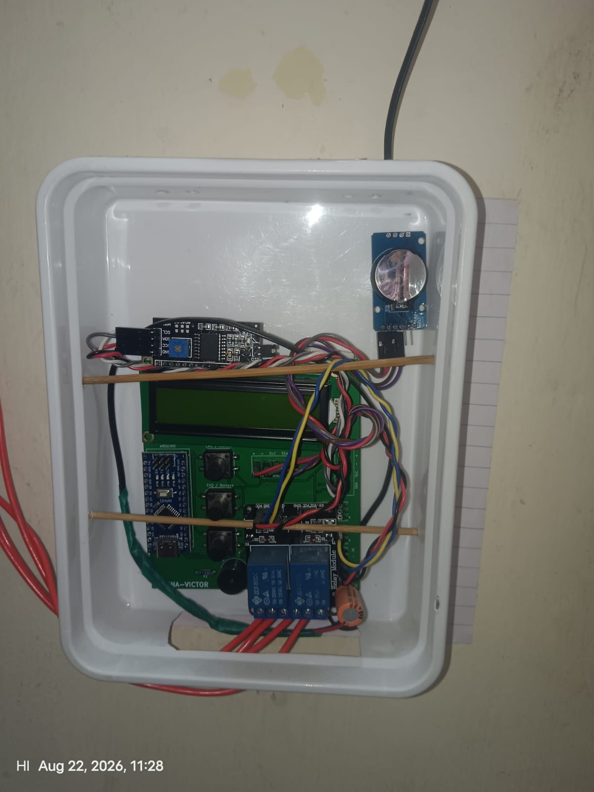
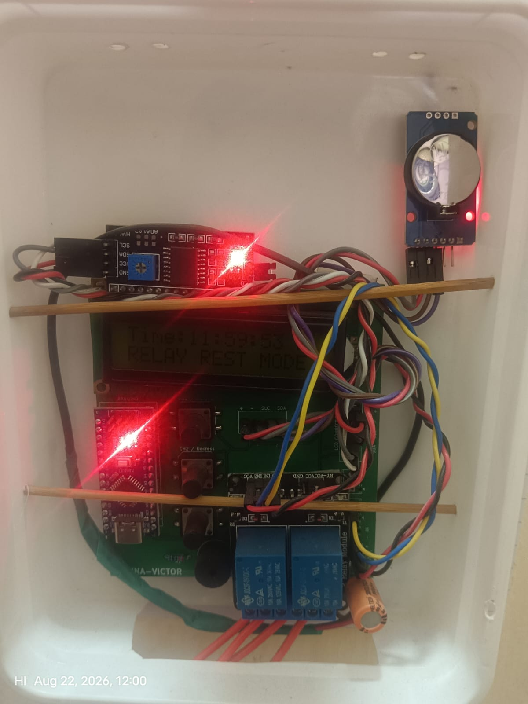
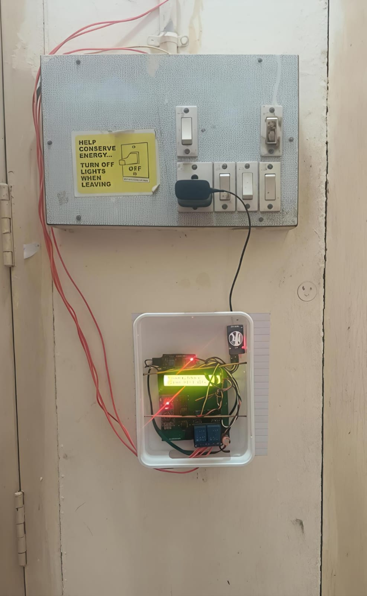

# Automated Time-Based Relay Switching System

> An Arduino-based embedded control system for automatically switching electrical loads according to user-defined time schedules using a DS3231 real-time clock.


## Overview

The **Automated Time-Based Relay Switching System** is an embedded automation project designed to control electrical loads automatically according to predefined ON/OFF schedules.

The system uses an **Arduino**, a **DS3231 real-time clock (RTC)**, a **16×2 I2C LCD**, two relay channels, push buttons, a buzzer, and non-volatile EEPROM storage.

Users can configure multiple ON/OFF schedules for each relay channel directly from the device. The programmed schedules remain stored even after power is removed.

## Key Features

* ⏰ Accurate timekeeping using a **DS3231 RTC**
* 🔌 Independent control of **two relay channels**
* 🕒 **Three programmable ON/OFF schedules per channel**
* 💾 Permanent schedule storage using **Arduino EEPROM**
* 🖥️ 16×2 I2C LCD for time and relay-status display
* 🎛️ Three-button user interface for configuration and control
* 🔄 Automatic and manual relay-control modes
* 🔔 Buzzer feedback for user interactions and system events
* 🌙 Relay rest-time protection
* 🔁 Daily automatic system restart
* ⚠️ Schedule-overlap/conflict detection
* 🌙 Automatic LCD backlight timeout
* 🛠️ LCD recovery handling
* 🔐 Safe schedule validation and memory management
* 🌅 Support for schedules that cross midnight

## Prototype

### Hardware Implementation



The complete electronic system is assembled inside a compact enclosure containing the Arduino controller, DS3231 RTC, 16×2 I2C LCD, two-channel relay module, push buttons, buzzer, and supporting circuitry.

### System Working



The LCD displays the current time and relay operating status during system operation.

### Prototype Detail


A closer view of the internal hardware arrangement, wiring, controller, RTC module, LCD, and relay section.

### Final Installation



The completed prototype is connected to an electrical switchboard for automated time-based control of electrical loads.

## System Architecture

```text
                 ┌──────────────────────┐
                 │      DS3231 RTC      │
                 │    Real-Time Clock   │
                 └──────────┬───────────┘
                            │
                            ▼
┌──────────────┐     ┌──────────────────┐     ┌──────────────┐
│   Buttons    │────►│     Arduino      │────►│ Relay CH1    │
│ B1 / B2 / B3 │     │   Controller     │     └──────────────┘
└──────────────┘     │                  │
                     │  Schedule Engine │────► Relay CH2
┌──────────────┐     │                  │
│ 16×2 I2C LCD │◄────│  EEPROM Storage  │
└──────────────┘     └────────┬─────────┘
                              │
                              ▼
                       ┌──────────────┐
                       │    Buzzer    │
                       └──────────────┘
```

## Hardware

| Component       | Purpose                                   |
| --------------- | ----------------------------------------- |
| Arduino         | Main system controller                    |
| DS3231 RTC      | Accurate real-time clock                  |
| 16×2 I2C LCD    | User interface and status display         |
| 2-Channel Relay | Switching two electrical loads            |
| 3 Push Buttons  | Schedule configuration and manual control |
| Buzzer          | Audible feedback                          |

## Relay Channels

The system provides two independently controlled relay channels:

* **Channel 1**
* **Channel 2**

Each channel can operate in:

* **AUTO mode**
* **MANUAL ON mode**
* **MANUAL OFF mode**

The relay outputs use **active-LOW control**.

## Programmable Scheduling

Each relay channel supports **three independent schedule slots**:

```text
Channel 1
 ├── S1 → ON time / OFF time
 ├── S2 → ON time / OFF time
 └── S3 → ON time / OFF time

Channel 2
 ├── S1 → ON time / OFF time
 ├── S2 → ON time / OFF time
 └── S3 → ON time / OFF time
```

Each schedule stores:

* ON hour
* ON minute
* ON second
* AM/PM
* OFF hour
* OFF minute
* OFF second
* AM/PM

The scheduling logic also supports time intervals that cross midnight.

## EEPROM Schedule Storage

The programmed schedules are stored in the Arduino's **EEPROM**.

This means the configured timing information can be restored after a power interruption.

The system stores the schedules for both relay channels and restores them during startup.

A protected memory-clear function is also implemented to erase all stored schedules intentionally.

## Manual Override

The system allows temporary manual control of each relay.

A long button press cycles a channel through:

```text
AUTO
  ↓
MANUAL ON
  ↓
MANUAL OFF
  ↓
AUTO
```

Manual control is temporary. The automatic schedule system can be restored when required.

## Relay Rest Mode

A configurable relay rest period is implemented to prevent automatic scheduling during a defined time window.

The current firmware configuration uses:

```text
06:00 AM → 06:00 PM
```

During the automatic rest period, scheduled relay operation is blocked while manual ON control remains available.

## Daily Automatic Restart

The firmware includes a daily automatic restart mechanism.

The current configuration performs the restart at:

```text
06:05 AM
```

The restart uses the Arduino watchdog timer to perform the reset.

## Schedule Conflict Detection

The system checks programmed schedules for conflicts.

This helps prevent overlapping schedule entries from creating unintended relay behavior.

The scheduling logic also handles schedules that cross midnight, such as:

```text
ON  → 11:00 PM
OFF → 06:00 AM
```

## LCD Interface

The 16×2 I2C LCD displays information such as:

* Current time
* Relay Channel 1 status
* Relay Channel 2 status
* Automatic/manual operating mode
* Active schedule number
* Configuration information
* System messages

The LCD backlight automatically turns off after a period of inactivity and wakes when a button is pressed.

## Button Controls

The system uses three buttons:

| Button | Main Function                                |
| ------ | -------------------------------------------- |
| B1     | Channel 1 schedule setup / manual control    |
| B2     | Channel 2 schedule setup / manual control    |
| B3     | Navigation / save / return to automatic mode |

Short and long button presses are used to provide multiple control functions without requiring a large number of physical buttons.

## Software

The firmware is written in **Arduino C/C++**.

### Main Libraries

```cpp
#include <Wire.h>
#include <RTClib.h>
#include <LiquidCrystal_I2C.h>
#include <EEPROM.h>
#include <avr/wdt.h>
```

### Main Software Modules

The firmware contains logic for:

* RTC time management
* Schedule configuration
* Schedule validation
* Schedule conflict detection
* Automatic relay control
* Manual relay control
* EEPROM storage
* LCD display management
* Button debouncing
* Buzzer control
* LCD recovery
* Backlight management
* Daily watchdog restart
* Memory erase functionality

## Pin Configuration

| Function        | Arduino Pin |
| --------------- | ----------: |
| Relay Channel 1 |          D8 |
| Relay Channel 2 |          D9 |
| Button 1        |          D4 |
| Button 2        |          D5 |
| Button 3        |          D6 |
| Buzzer          |          D2 |
| I2C LCD         |         I2C |
| DS3231 RTC      |         I2C |

## How It Works

1. The DS3231 provides the current time.
2. The Arduino reads the current RTC time.
3. The configured schedules are checked continuously.
4. The system determines whether each relay should be ON or OFF.
5. The appropriate relay channel is activated.
6. The LCD displays the current system status.
7. Schedule settings are stored in EEPROM.
8. After power restoration, previously stored schedules can be recovered.
9. Users can temporarily override automatic operation using the buttons.

## Applications

This type of system can be used for:

* 💡 Automatic lighting
* 🏠 Home appliance scheduling
* 🌱 Agricultural equipment timing
* 💧 Water-pump scheduling
* 🏭 Periodic industrial loads
* 🔌 Energy-management applications
* 🏫 Educational embedded-systems projects

## Project Structure

```text
Automated-Time-Based-Relay-Switching-System/
│
├── Automated_Time_Based_Relay_Switching_System.ino
├── README.md
└── LICENSE
```

Additional documentation, hardware files, photographs, and diagrams can be added as the repository is expanded.

## Future Improvements

Possible future development includes:

* [ ] Mobile-app control
* [ ] Wi-Fi/Bluetooth connectivity
* [ ] Remote schedule configuration
* [ ] Energy-consumption monitoring
* [ ] Web-based dashboard
* [ ] More relay channels
* [ ] Improved enclosure and PCB integration
* [ ] Real-time notifications
* [ ] Cloud-based scheduling

## Project Status

**Completed Prototype**

The current repository contains the Arduino firmware used for the project.

Future versions may extend the system with wireless connectivity, improved hardware integration, and additional automation features.

## Author

**SWISSLIN RAJ V**

Electronics & Communication Engineering

Interested in:

* Embedded Systems
* VLSI & FPGA
* Processor Design
* Electronics
* PCB Design
* AI Hardware

## License

This project is licensed under the **Apache License 2.0**.

See the [`LICENSE`](LICENSE) file for details.
